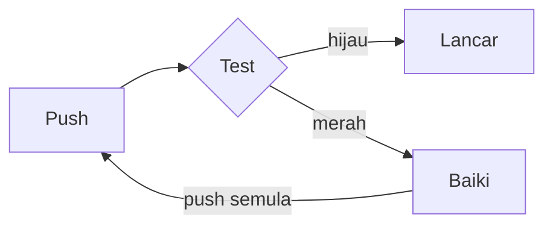

# CI/CD 2 — Bina + Uji (Build + Test)

**GitHub Actions · Quality Gates before Production**

---

## 📍 Session Map — CI/CD Track

| Session | Topic | Status |
|---------|-------|--------|
| CI/CD 1 | GitHub Actions | ✅ Selesai |
| **CI/CD 2** | **Bina + Uji** | **🎯 Hari ini** |
| CI/CD 3 | Pembolehubah (Variables) | Sesi 23 |
| CI/CD 4 | GHCR + Runner | Sesi 24 |

---

## 🚨 Problem: Broken Config Slips Through

**CI/CD 1 behaviour:** Every push → build & deploy. **No gate.**

```json
// ship.config.json
{
  "shipName": "Nebula Runner",
  "color": "22d3ee",   // missing #
  ...
}
```

| What happens | Result |
|--------------|--------|
| Config `color` is wrong | ❌ Invalid value |
| Actions still green | ⚠️ Page deploys with **no warning** |

> **💡 Need:** One **gate** that stops bad changes from reaching production.

---

## 🔢 Exit Code — The Hidden Number

Every command ends with a hidden number called the **exit code**.

| Exit Code | Meaning | Status |
|-----------|---------|--------|
| **0** | Command succeeded | ✅ **PASS** (lulus) |
| **1** (or any non-zero) | Problem occurred | ❌ **FAIL** (gagal) |

**Check it yourself:**

```bash
echo $?
```

---

## 🧪 Amali 1 — Test on Your Machine First

Run these in your own terminal:

```bash
cd devops-bootcamp-shipit && code .

git fetch upstream && git merge upstream/main

cd launchpad && npm run test
echo $?

# Remove # from color → test again
npm run test
echo $?
```

| Step | What to do |
|------|------------|
| Open editor | `Ctrl + \`` inside the repo |
| Update from upstream | `git fetch` + `git merge` |
| Test green | Config OK → exit **0** |
| Break config | See exit **1** |

---

## 🛑 Red Test Stops the Pipeline

```
Install ✅ ──→ Test ❌ ──×── Build  ──×── Deploy
                 (exit 1)
```

- Test red (exit 1) → **later steps stop**
- Nothing continues after a failed test

> New component in the pipeline: **Test** as a hard stop.

---

## 🛠️ Amali 2 — Add Test Step to Pipeline

Edit `.github/workflows/deploy.yaml`:

1. **Rename** job `say-hello` → `test`
2. **Insert** step `npm run test` **before** `npm run build`

Then normal git flow:

```
branch: add-test
commit: pre-flight test
```

| In PR | Production |
|-------|------------|
| ❌ Test fails (you can still merge for now) | ✅ Still safe |

---

## 👁️ → 🧪 Test Step Becomes the Gate

| Manual check | Automated check |
|--------------|-----------------|
| Read `ship.config.json` with your eyes | `- run: npm run test` |
| Humans miss things | Same check on **every** push |

**Not only npm** — every ecosystem has its own test command:

| Ecosystem | Command |
|-----------|---------|
| Python | `pytest` |
| PHP | `vendor/bin/phpunit` |
| .NET | `dotnet test` |
| Java | `mvn test` |

---

## 🔒 Amali 3 — Lock Merge on Your Fork

**Settings → Branches → Add branch protection rule**

```
Branch name pattern: main
[x] Require status checks to pass before merging → test
[x] Do not allow bypassing the above settings
Create
```

**Result:**

> 🔒 **Merging is blocked**  
> PR must be green again before code can be merged.

---

## 🛡️ Gate Not Yet Proven

Red from Amali 2 is not enough. **Prove** the gate works.

```json
// ship.config.json
{
  "shipName": "",      // empty!
  "color": "22d3ee",
  ...
}
```

| Observation | Meaning |
|-------------|---------|
| `shipName` empty | ❌ Invalid |
| Test turns red | ✅ Gate is working |
| Code blocked from production | 🛡️ Safety achieved |

---

## 🔄 Amali 4 & 5 — Break Then Fix

### Amali 4 — Send broken config

- Empty `shipName` → `""`
- branch: `add-test` · commit: `empty name`
- **In PR:** ❌ test fails → **Merging is blocked**
- Production stays safe

### Amali 5 — Fix the config

- Fill `shipName` + restore `#` on color
- branch: `add-test` · commit: `baiki nama ship`
- **In PR:** ✅ All checks passed → Merge button opens
- After merge → open Actions and watch CI/CD run

---

## 🔁 Red → Green Loop



> Gate validates **every push** before deploy.

---

## 🧩 One Job or Two Jobs?

### Satu job (one job)

```
test:
  - pasang
  - uji
  - bina
  - lancar
→ satu runner
```

### Dua job (two jobs)

```
test:                  deploy:
  - pasang               - bina
  - uji                  - lancar
         needs: test
→ runner sendiri   ·   runner sendiri
```

> **Split jobs** when you need parallel work or different runners.

---

## 🏗️ Amali 6 & 7 — Split into test + deploy

### Structure of `deploy.yaml`

```yaml
defaults:
  run:
    working-directory: launchpad

jobs:
  test:
    runs-on: ubuntu-latest
    steps:
      - uses: actions/checkout@v7
      - uses: actions/setup-node@v7
      - run: npm clean-install
      - run: npm run test          # ← gate

  deploy:
    needs: test                   # ← wait for test green
    runs-on: ubuntu-latest
    steps:
      - uses: actions/checkout@v7
      - uses: actions/setup-node@v7
      - run: npm clean-install
      - run: npm run build
      - uses: actions/upload-pages-artifact@v5
      - uses: actions/deploy-pages@v5
```

| Keyword | Meaning |
|---------|---------|
| `defaults:` | Once for all jobs |
| `test:` | First job under `jobs:` |
| `runs-on:` | Each job picks its own runner |
| `needs: test` | Deploy waits for test to be green |
| Fresh instance | Each job reinstalls from scratch |

---

## 🖥️ Each Job Gets a Fresh Instance

```
job test:                     job deploy:
  checkout                      checkout
  setup-node                    setup-node
  npm clean-install             npm clean-install
  npm run test                  npm run build
  ──────────────                ──────────────
  instance destroyed            instance destroyed
```

> **No shared files** between jobs.  
> Each job installs everything itself on a brand-new runner.

---

## ✅ Key Takeaways

1. **Exit code 0 = pass, non-zero = fail** → `echo $?`
2. **Add a test step** before build/deploy → it becomes the first gate
3. **Branch protection** locks merge → require the `test` status check
4. **Prove the gate** with broken config → then fix and see green
5. **Split jobs with `needs:`** when useful → each job gets a fresh runner

---

## 📋 Practice Checklist

- [ ] Local: `npm run test` + `echo $?` (see 0 vs 1)
- [ ] Pipeline: rename job to `test`, add `npm run test` step
- [ ] Branch protection: require status check `test`
- [ ] Break config → PR red + merge blocked
- [ ] Fix config → PR green + merge opens
- [ ] Split: `test` job + `deploy` job with `needs: test`
- [ ] Confirm each job reinstalls on a fresh runner

---

**Next up:** CI/CD 3 — Pembolehubah (Variables) · Session 23
